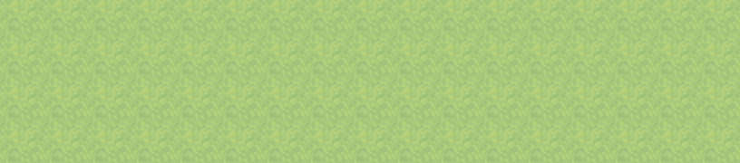

# AnimatedMessage <动画消息>

提供消息框文字的动画效果  
完成精灵动画功能的三个插件之一  
+ 插件[`TextSprite`](./TextSprite)(本插件)
  - 用于支持绘制和控制播放动画等
+ 插件[`SpriteAnimationSet`](./SpriteAnimationSet)
  - 用于提供处理动画效果等
+ 插件[`SpriteAnimManager`](./SpriteAnimManager)
  - 用于设置动画和动画参数、处理消息框文字播放动画等


## 使用方法

按顺序导入 完成精灵动画功能的三个插件  
+ [`TextSprite`](./TextSprite)
+ [`SpriteAnimationSet`](./SpriteAnimationSet)
+ [`SpriteAnimManager`](./SpriteAnimManager)

配置和使用 见插件[SpriteAnimManager](./SpriteAnimManager)和[TextSprite](./TextSprite)  


## 效果展示

#### 基础效果快速出现展示
```
◆插件指令：AnimMgr setAnim 101 2
◆文本：无, 窗口, 底部
：　　：动画 淡入淡出(code=2)：\TEXTANIM[101]
：　　：\TAPlay[101]这是快速出现的\C[20]颜色\C[0]和图标\I[84]和角色名\N[1]
```
| code | 动画效果 | 动画名  | 动画展示 |
| :- | :------- | :-----  | :------- |
|  2 | 淡入淡出 | Fade     |  |
|  3 | 缩放     | Zoom     |  |
|  4 | 翻转     | Zoom2    |  |
|  5 | 上下出现 | Wipe     | (todo) |
|  6 | 震动     | Shake    |  |
|  7 | 剧烈缩放 | Zoom3    |  |
|  8 | 波浪缩放 | Wave     |  |
|  9 | 旋涡     | Rotation |  |
| 10 | 摇晃     | Swing    |  |
| 11 | 随机     | Random   |  |
| 52 | 文字居中 | TextCenter |  |

#### 复合效果快速出现展示
```
◆插件指令：AnimMgr setAnim 101 10
◆插件指令：AnimMgr setAnim 102 11
◆文本：无, 窗口, 底部
：　　：动画 摇晃(code=10)+随机(code=11)：\TEXTANIM[101]\TEXTANIM[102]
：　　：\TAPlay[101]\TAPlay[102]这是快速出现的\C[20]颜色\C[0]和图标\I[84]和角色名\N[1]
```
| code | 动画效果 | 动画名  | 动画展示 |
| :- | :------- | :-----  | :------- |
| 2+3 | 淡入淡出+缩放 |     |  |
| 2+52 | 淡入淡出+文字居中 | |  |
| 10+11 | 摇晃+随机 |       |  |

#### 基础效果顺序出现展示
```
◆插件指令：AnimMgr setAnim 101 2
◆文本：无, 窗口, 底部
：　　：动画 淡入淡出(code=2)：\TEXTANIM[101]
：　　：\TAPlay[101]这是顺序出现的\C[20]颜色\C[0]和图标\I[84]和角色名\N[1]
```
| code | 动画效果 | 动画名  | 动画展示 |
| :- | :------- | :-----  | :------- |
|  2 | 淡入淡出 | Fade     |  |
|  3 | 缩放     | Zoom     |  |
|  4 | 翻转     | Zoom2    |  |
|  5 | 上下出现 | Wipe     | (todo) |
|  6 | 震动     | Shake    |  |
|  7 | 剧烈缩放 | Zoom3    |  |
|  8 | 波浪缩放 | Wave     |  |
|  9 | 旋涡     | Rotation |  |
| 10 | 摇晃     | Swing    |  |
| 11 | 随机     | Random   |  |
| 52 | 文字居中 | TextCenter |  |

#### 复合效果顺序出现展示
```
◆插件指令：AnimMgr setAnim 101 10
◆插件指令：AnimMgr setAnim 102 11
◆文本：无, 窗口, 底部
：　　：动画 摇晃(code=10)+随机(code=11)：\TEXTANIM[101]\TEXTANIM[102]
：　　：\TAPlay[101]\TAPlay[102]这是顺序出现的\C[20]颜色\C[0]和图标\I[84]和角色名\N[1]
```
| code | 动画效果 | 动画名  | 动画展示 |
| :- | :------- | :-----  | :------- |
| 2+3 | 淡入淡出+缩放 |     |  |
| 2+52 | 淡入淡出+文字居中 | |  |
| 10+11 | 摇晃+随机 |       |  |

#### 其他效果展示
| code | 动画效果 | 动画名  | 动画展示 |
| :- | :------- | :-----  | :------- |
| 32 | 卡拉OK     | Karaoke   |  |


## Author
Mikan(MikanHako)  
Copyright (C) 2020-2021 Mikan(MikanHako)  
